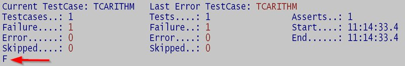

# NatUnit 2.0

NatUnit is an open-source unit testing framework for Software AG's programming language Natural.

It's written in 100% Natural and can be used in any Natural environment (LUW, Mainframe). There's no need to have NaturalONE, a web server, or any other additional component. **It's all plain Natural!**

However, if you want, NatUnit can be integrated into NaturalONE and even in a Continuous Integration build process, e.g. with Jenkins.

## Features

*   You can **test any Natural module** that produces output that you can access programatically, i.e. subprograms, external subroutines, functions, or even internal subroutines inside copy codes.
*   Tests are **plain Natural modules**. No need to learn a new language.
*   The framework itself is written in **100% Natural** and should run on any platform.
*   Over **25 built-in assertions** (equality, comparisons, searching for array elements or substrings, Natural errors).
*   Built-in support for **Parameterized Tests** and **TestSuites**.
*   Tests are executed in **randomized order** to prevent unwanted dependencies.

## Getting started

### Nomenclature

*   **TestCase**: A *TestCase* is the basic entity in NatUnit. It's a Natural **subprogram** that tests the functionality of another Natural module. Example: If you have a Natural module `CALCPREM` that calculates a premium for an insurance contract, you could create a TestCase `TCCALCPR` that tests whether the premium is calculated correctly. In most cases, there are many different scenarios that have to be tested, e.g. calculating the premium for an adult vs. for a child. Therefore, TestCases can contain multiple *Tests* that check these different requirements.
*   **Test**: *Tests* are used to check a single scenario, use case, or requirement of the module under test. In our example from above, you could create one Test for an adult and one for a child. They both test the same module, but the input and/or output parameters may be different, e.g. the `AGE` of the person in the first Test may be `35` and `17` in the second Test. And of course the result (the premium for the two people) will be different, too. Tests are written as `IF` **statements** inside the subroutine `TEST` inside the TestCase.
*   **Parameterized Test/TestData**: If a single Test has to be run multiple times with different arguments, you can create a *Parameterized Test*. For example, if you wanted to check the premium calculation for children for multiple ages that should all result in the same premium, you could run the same test with these different ages. The Parameterized Test is simply a Test like described above. However, the actual arguments for the Parameterized Test are provided by NatUnit through **annotations** (like `@TestData`) inside **comments** in the TestCase's code. Each individual Test is run in isolation and can therefore fail without affecting the other test runs.
*   **Assertion**: The comparison of the actual and expected values is done by calling *Assertions*. These are **external subroutines** that come with NatUnit and can also easily be extended for your custom needs. A basic Assertion compares two values and raises a special Natural error, if the values don't match. But there are plenty of other Assertions, e.g. for finding elements in arrays or checking that a Natural error occured. A Test can contain multiple Assertions. However, the first failing Assertion ends the Test. In our example a possible Assertion could check, whether the premium for a child is lower than the premium for an adult (pseudo code: `ASSERT-NUM-GREATER-THAN #PREMIUM-ADULT #PREMIUM-CHILD`).
*   **TestSuite**: TestCases can be grouped to form *TestSuites*. These are also **subprograms** that only contain a list of TestCases to be executed. In our example multiple TestCases for different modules in the insurance domain could be grouped inside `TSINSURA` to be able to execute them all at once with a single command.
*   **Basic hierarchy**: A TestSuite can contain multiple TestCases. A TestCase can contain multiple Tests. A Test can have multiple TestData arguments and can also contain multiple Assertions.

### A basic TestCase with one Test and one Assertion

NatUnit's TestCases are simply Natural subprograms that follow certain conventions (i.e. use a special PDA, define some inline subroutines etc.).

The subprogram's name should start with `TC` to distinguish them from other modules, but this is only a convention. NatUnit itself doesn't care about names and only checks the aforementioned conventions like PDA usage etc.

Here's a basic TestCase that should be pretty self-explanatory.

    /* File: TCARITHM
    DEFINE DATA
    
    PARAMETER USING NUTESTP /* (1)
    
    LOCAL USING NUCONST /* (2)
    LOCAL USING NUASSP /* (2)
    
    LOCAL /* (3)
    01 #X (N4)
    01 #Y (N4)
    01 #Z (N4)
    
    END-DEFINE
    
    NUTESTP.FIXTURE := 'Basic arithmetic operations' /* (4)
    
    INCLUDE NUTCTEMP /* (5)
    
    DEFINE SUBROUTINE TEST /* (6)
    
    IF NUTESTP.TEST EQ 'two numbers should be added' /* (7)
      #X := 5
      #Y := 6
      #Z := #X + #Y
      ASSERT-LINE := *LINE; PERFORM ASSERT-NUM-EQUALS NUASSP 11 #Z /* (8) 
    END-IF
    
    END-SUBROUTINE
    
    END

1.  Every TestCase needs to use the PDA `NUTESTP` so the framework can call it and get the test results back.
2.  The LDA `NUCONST` (constants, e.g. for the test results) and the PDA `NUASSP` are used for internal processing and calling the assertions.
3.  These are plain old local variables for the "business logic". You can use whatever you want/need here.
4.  The *Fixture* describes what the TestCase is actually testing and is used as a human-readable description when tests fail. It's plain text so you can write anything you want here including punctuation, so you're not forced to the 8 characters of the subprogram's name.
5.  The CopyCode `NUTCTEMP` defines the basic program flow of every TestCase (e.g. call sequence, error handling). `TEMP` stands for *template method*, an object-oriented design pattern.
6.  The inline subroutine `TEST` is used to define the individual Tests of this TestCase.
7.  This is an actual Test. Every Test is defined as an `IF` statement to be able to describe it with plain text (including punctuation etc.) like the fixture above.
8.  The Assertion in this line compares the actual result of the business logic (the sum in variable `#Z`) to the expected value (`5 + 6 = 11`) and fails, if the two don't match.

### Execute a single TestCase

You can run a single TestCase with `NUSINGLE`.

If all Tests are successful, the result looks like this:

Every dot (`.`) stands for a successful Test. If you change the Assertion to this:

    ASSERT-LINE := *LINE; PERFORM ASSERT-NUM-EQUALS NUASSP 12 #Z

The Test will fail and produce a different output (`F` for *failure*):

And after you press `Enter`, the following message explaining the failure including actual (`11`) and expected (`12`) values and the Natural line number (`26`) of the assertion in `TCARITHM` will be shown:

    (F) two numbers should be added TCARITHM (26) failed: <11> should be <12>

You can now correct your code and run the same TestCase over and over again simply by pressing `Enter`.

## Installing NatUnit

### Download

You can download NatUnit for free (please respect the license: LGPL) from GitHub: [AlteOldenburger / NatUnit](https://github.com/AlteOldenburger/NatUnit "AlteOldenburger / NatUnit").

### Prerequisites

The following User Exits are used by NatUnit and have to be present.

*   `USR0020N`: Read any error message from FNAT or FUSER
*   `USR1040N`: Get or set profile parameter UDB
*   `USR1057N`: Read a Natural source code into an array
*   `USR2013N`: Get SYSPROF information
*   `USR4208N`: Read or write a Natural resource
*   `USR6006N`: Get path to system file (*optional*, only on Linux)

### Installation

The repository contains a working project for NaturalONE that you can directly **import into your workspace**.

If you want to integrate the framework into your Natural environment, simply **copy the source files** to a library of your choice and catalog them on the server.

### Self-test

You can run `TESTNU` to execute NatUnit's internal tests. If they all pass, the framework works as expected and you're good to go!

